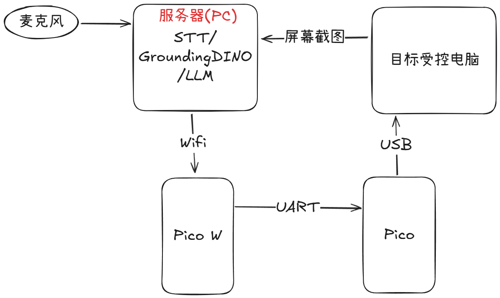

# LLMKeyMouse(AI键鼠、基于视觉的大模型键鼠)
基于大模型的键鼠，或者更加通俗的，可以称之为AI键鼠。本仓库的目标是实现一个AI键鼠，能够与使用者进行交互。

## 说明
自动化控制电脑端光标和输入的方式有很多，例如Python 的 pyautogui 和 pyperclip 库，但是这些库都是基于软件侧的，容易受到其他软件的干扰。例如 le⚪ov⚪ 商城的弹窗，如果你在执行自动化脚本的过程中遭受了弹窗，你的光标则无法正常控制。

而本仓库的实现则基于硬件侧，一方面能够避免上述问题，另外一方面，是软硬件结合工作的尝试。

## 对AI键鼠的定义
截至当前，2024年11月13日，大语言模型已经火热了数年，市场上已经有很多产品明确说自己是AI鼠标，但其本质只是“要求用户下载一个APP，从而你可以在APP中输入，让APP给你回复”，而这个鼠标的“AI”之处在于，它可以有一个按键用于一键打开APP。

本仓库的开发者 @Liyulingyue 认为，这个APP中的功能可以是AI鼠标的组成部分，但这些功能并不是AI鼠标的必要部分。而一个AI键鼠(AI综合输入设备)应当是：
> 能够接受用户的输入(例如语音)，并且根据用户的输入，由大模型（AI）驱动，进行光标、按键控制。

例如，我们需要关闭音乐播放器，我们可以说“关闭音乐”，AI键鼠(包含其背后支持的软件)需要获取到桌面元素，判断音乐播放软件上结束按钮的位置、光标的位置，将光标移动到结束按钮的位置上，然后按下结束按钮。

当然，如果你需要大模型问答活动，你可以在硬件设备上增加一个麦克风，从而AI键鼠(包含其背后支持的软件)会把你的语音发送到大模型中，并通过显示器展示答案。
但毫无疑问，即使我们的硬件设备上没有这个功能，你也可以自己打开 ChatGPT 或者文心一言等网页，获得相关回复，所以这并不是我们所谓的AI键鼠的核心能力。

本仓库作为一个小小的 Demo，仅仅对 AI键鼠 的核心功能进行开发。

## 硬件环境
本仓库的实现依赖于硬件环境(树莓派Pico W 和 树莓派Pico)。

## 软件环境
Python 3.10

## 技术路线
控制流程如下：

### 树莓派 Pico 充当键鼠
如何用树莓派 Pico 充当键鼠参考 [adafruit教程](https://learn.adafruit.com/circuitpython-essentials/circuitpython-hid-keyboard-and-mouse).

### 树莓派 Pico 与 树莓派 Pico W / PC 通信
树莓派 Pico W 和 树莓派 Pico 的通信使用 UART 串口通信。树莓派 Pico W 和电脑端使用 Wifi 通信。

### STT
语音转文字采用 PaddleSpeech 进行。

### GroundingDINO
GroundingDINO 模型是一个通用场景检测模型，用于确定光标、其他物品位置。

### LLM
为了简单的获取大模型对话补全服务，我们采用文心一言 3.5。

## 仓库文件设置
所有上位机代码放在目录 UpperComputer 中，所有下位机代码放在 LowerComputer 中。

